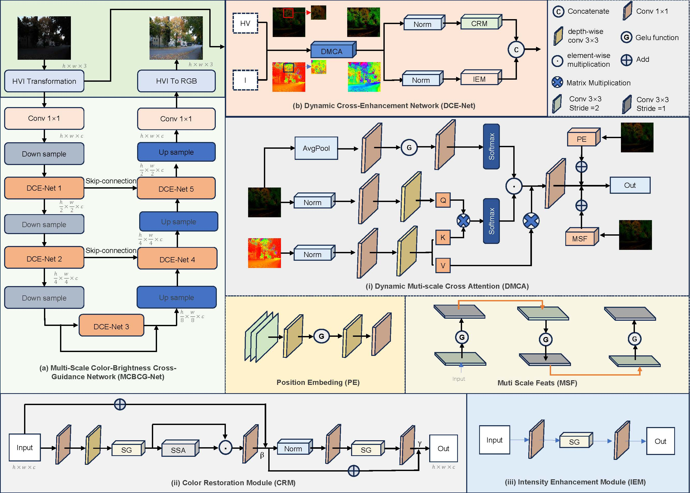
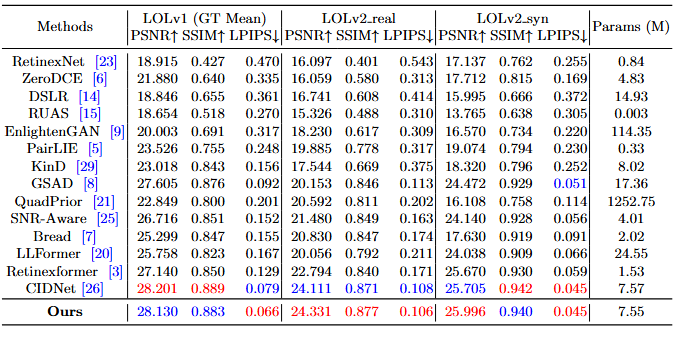
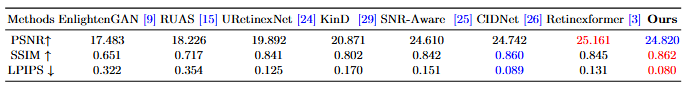
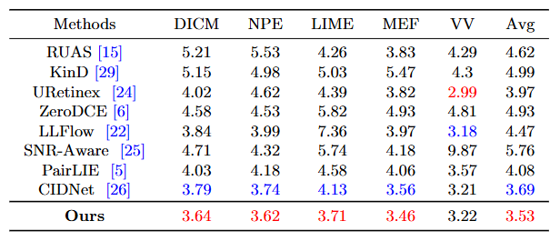
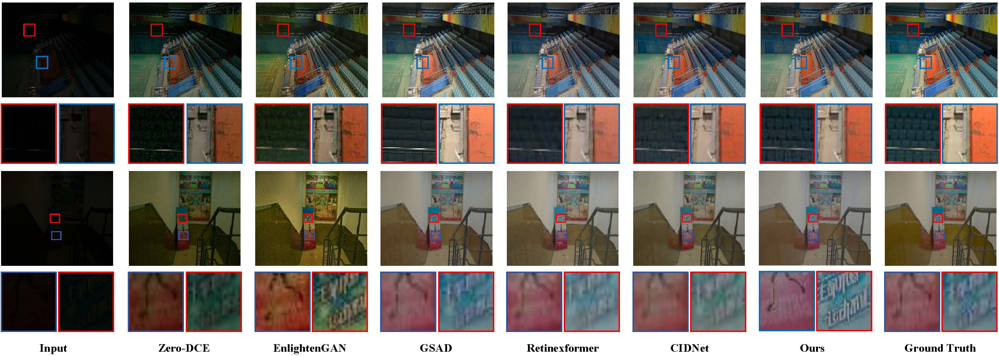
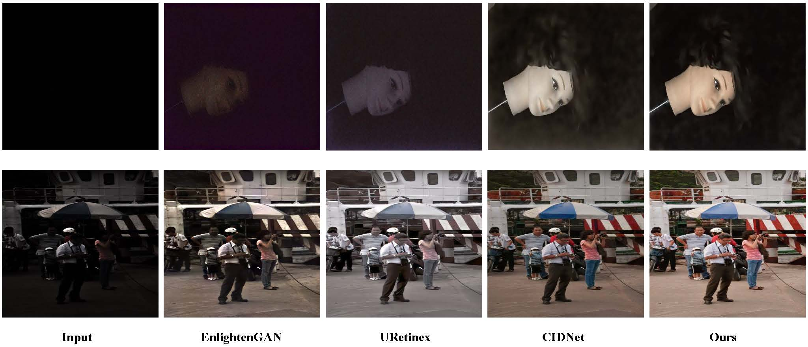
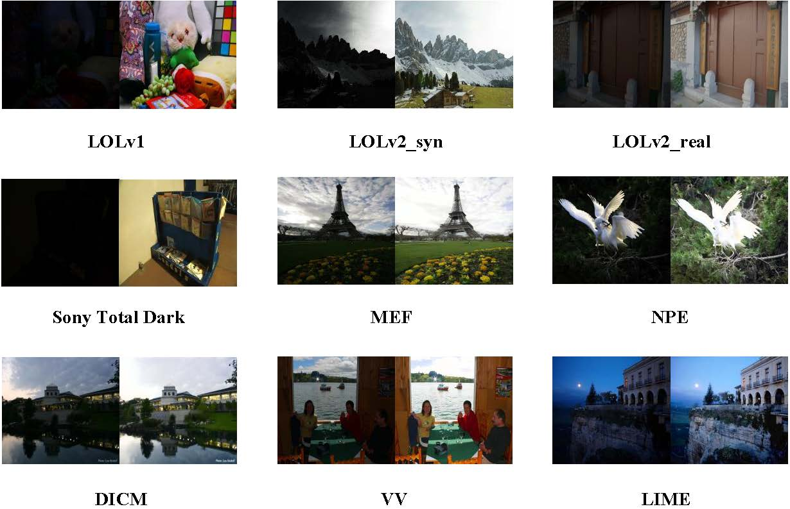

# MCBCG-Net: Multiscale Color-Brightness Dynamic Cross-Guided Dual-Branch Low-Light Image Enhancement Network

**Abstract:** Low-light image enhancement (LLIE) aims to restore brightness and color information in low-light images while suppressing noise. Although deep learning methods based on Retinex theory and Transformer architectures have made progress, they often exhibit limited robustness, being suitable only for specific scenarios and struggling to adapt to real-world applications. Moreover, many methods overemphasize brightness enhancement, neglecting the guiding role of color information in image restoration, which results in artifacts such as overexposure and color distortion. To address these challenges, we propose a Dynamic Multi-scale Cross-Attention (DMCA) mechanism and design a Color Restoration Module (CRM) and an Intensity Enhancement Module (IEM), integrated into an innovative dual-branch architecture to construct a Dynamic Cross-Enhancement Network (DCE-Net). DCE-Net is further embedded within a U-Net framework to form the Multi-scale Color-Brightness Cross-Guidance Network (MCBCG-Net). The DMCA mechanism dynamically adjusts multi-scale feature weights to flexibly capture local details and global context, significantly improving adaptability to complex low-light scenarios. The dual-branch structure enables collaborative optimization through color-brightness cross-guidance, ensuring balanced enhancement and mitigating artifacts. Extensive experiments on nine diverse paired and unpaired datasets demonstrate that MCBCG-Net outperforms existing methods in color fidelity, detail reconstruction, and visual quality, providing an efficient and robust solution for LLIE.

## Network Framework


## TODO

- [x] Testing Code & Checkpoint enhancement  
- [x] Model.py  
- [ ] Train.py  


## Quantitative Results

<details>
<summary>LOLv1 and LOLv2:</summary>



LOLv1 without GT mean:

</details>


<details>
<summary>SonyTotalDark:</summary>


</details>

<details>
<summary>Unpaired datasets:</summary>



</details>


## Qualitative Results. 

<details>
<summary>LOLv1 and LOLv2:</summary>



</details>


<details>
<summary>SonyTotalDark:</summary>


</details>


<details>
<summary>Unpaired datasets:</summary>



</details>


## Dependencies and Installation

- Python >= 3.8
- Pytorch >= 1.13.1
- CUDA >= 11.6
- Other required packages in requirements.txt

``` python
conda create -n envname python=3.8
conda activate envname
pip install pytorch=1.13 
pip install -r requirements.txt
```